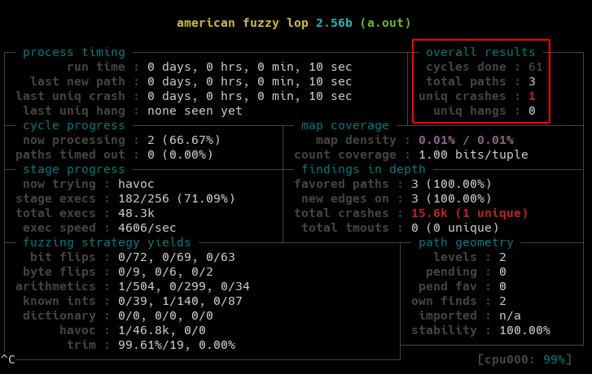

# Getting Started with AFL

> All the activities in this document are performed within the Fuzzer VM

## First Fuzz

We will fuzz the program `hello-vulnerable-world.c` available in `src` directory in the repo.

We start by compiling the target program using `afl-gcc`

```
cd /vagrant/src/
afl-gcc hello-vulnerable-world.c 
```

Create the input and output directories

```
mkdir -p /tmp/h1/input /tmp/h1/output
```

Create random input corpus

```
openssl rand 1024 > /tmp/h1/input/rand
```

Start the fuzzing process

```
afl-fuzz -i /tmp/h1/input/ -o /tmp/h1/output/ -- ./a.out
```

> The above program receives input from STDIN. File inputs through command line argument can be passed using `@@` special marker.

Fuzzer status view indicates a crash within a few seconds of fuzzing process



List the mutated input that resulted in crash

```
ls -al /tmp/h1/output/crashes/
```

Manually reproduce a crash using one of the mutated files in the above directory

```
export f=$(ls /tmp/h1/output/crashes/ |head -n 1)
cat /tmp/h1/output/crashes/$f | ./a.out
```

## Am I doing it right?

One of things about finding bugs continuously is to ensure incremental improvement in fuzzing strategy. That means, when you start the fuzzing process, you must have the means to measure effectiveness of the current strategy.

This can be done using basic coverage analysis i.e. measure the code coverage ratio (or percentage) observed during fuzzing within a reasonable time period. If this is very less, then we must look into better strategy for fuzzing.

## Coverage Guided Fuzzing

> American Fuzzy Lop is a brute-force fuzzer coupled with an exceedingly simple but rock-solid instrumentation-guided genetic algorithm. It uses a modified form of edge coverage to effortlessly pick up subtle, local-scale changes to program control flow.

```
Simplifying a bit, the overall algorithm can be summed up as:

  1) Load user-supplied initial test cases into the queue,

  2) Take next input file from the queue,

  3) Attempt to trim the test case to the smallest size that doesn't alter
     the measured behavior of the program,

  4) Repeatedly mutate the file using a balanced and well-researched variety
     of traditional fuzzing strategies,

  5) If any of the generated mutations resulted in a new state transition
     recorded by the instrumentation, add mutated output as a new entry in the
     queue.

  6) Go to 2.
```

> http://lcamtuf.coredump.cx/afl/README.txt

### Static Analysis of Fuzz Target

[Basic Block](https://en.wikipedia.org/wiki/Basic_block) count in a program can be used as an indicator to measure coverage during fuzzing. However, a process consists of a main binary and associated shared libraries. In such a case, we need to identify the basic block count in the fuzz target i.e. the library or program that contains our target code.

## Reference

* [http://lcamtuf.coredump.cx/afl/QuickStartGuide.txt](http://lcamtuf.coredump.cx/afl/QuickStartGuide.txt)
* [http://lcamtuf.coredump.cx/afl/README.txt](http://lcamtuf.coredump.cx/afl/README.txt)