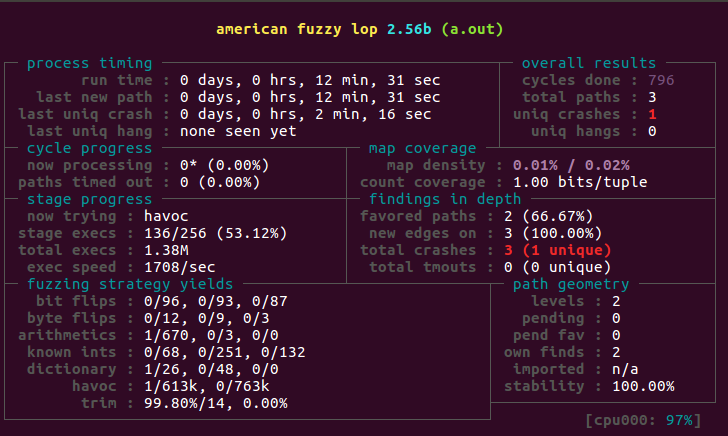

# Fuzzing in Persistent Mode

## Introduction

[Detailed](http://lcamtuf.blogspot.com/2015/06/new-in-afl-persistent-mode.html) description of fuzzing in *Persistent Mode*.

Example program

```c
main() {
  while(__AFL_LOOP(1000)) {
    char buf[100];
    int n = 0;

    memset(buf, 0, sizeof(buf));
    n = read(0, buf, sizeof(buf));

    target_function(buf, n)
  }
}
```

> Forking is expensive as it involves creating process context and its associated data structure. To optimize further, AFL supports in-process fuzzing where appropriate instrumentation code is generated to re-run the fuzz target with mutated input. `__AFL_LOOP` provides an indicator to AFL on each iteration of in-process fuzzing.

**Note:** For this to work, `afl-clang-fast` or `afl-clang-fast++` wrapper along with LLVM `clang` has to be used to build the fuzz target.

## Hands-on Exercise

Fuzz `ssrv.c` using AFL and identify the vulnerability.

## Solution

The target program is a network service which needs to be re-purposed to be able to fuzz with AFL. We apply the following patch to fuzz it with AFL in *Persistent Mode*

```diff
diff --git a/src/ssrv.c b/src/ssrv.c
index 56f3701..e633542 100644
--- a/src/ssrv.c
+++ b/src/ssrv.c
@@ -143,5 +143,14 @@ int srv_init()
 
 int main(int argc, char **argv)
 {
-       return srv_init();
+       // return srv_init();
+       while(__AFL_LOOP(1000)) {
+               char buf[1024];
+               int n = 0;
+
+               memset(buf, 0, sizeof(buf));
+               n = read(0, buf, sizeof(buf) - 1);
+
+               process_msg(-1, buf);
+       }
```

Compile the fuzz target

```
afl-clang-fast ./ssrv.c 
```

Create input and output directory

```
mkdir -p /tmp/ss/input /tmp/ss/output
```

Generate input corpus

```
openssl rand -hex 1024 > /tmp/ss/input/rand
```

Start the fuzzing

```
afl-fuzz -i /tmp/ss/input/ -o /tmp/ss/output/ -- ./a.out
```

To improve the effectiveness of the fuzzing process, create a dictionary with following content

```
sep="\x200"
cmd_echo="echo"
nullb="\x00"
data="AAAAA"
```

Restart the fuzzing process with custom dictionary

```
afl-fuzz -i /tmp/ss/input/ -o /tmp/ss/output/ -x /tmp/ss.dict -- ./a.out 
```

Fuzzer status after crash

